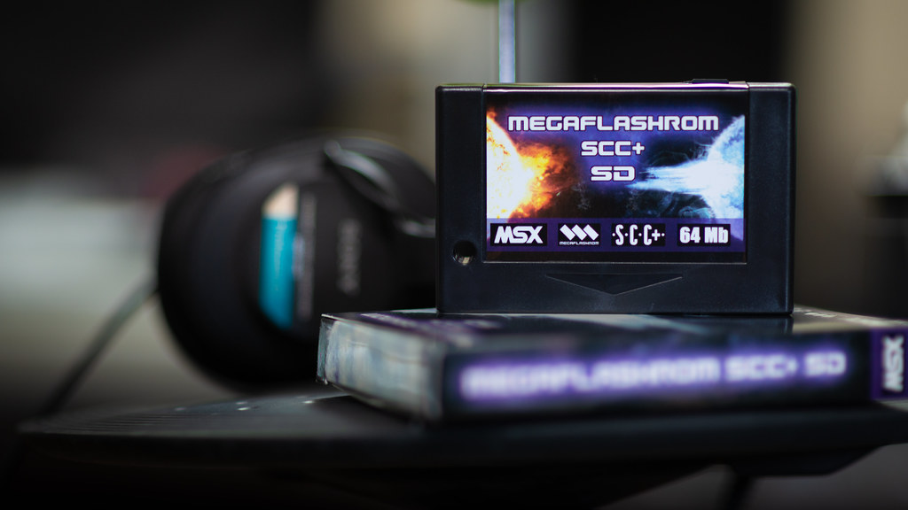

# mgLunch4MFRSSD
MSX mgLunch for MegaFlashRomSCC+SD 

mgLunch! is a MSX ROM launcher for MegaFlashSDSCC+

v1.19 :

USAGE

    mgLunch.com - mgLunch! for MegaFlashSDSCC+ 
    opfxsd.com  - romloader for MegaFlashSDSCC+
    mglCook.exe - rom file scanner for Windows xp/vista/7/8/8.1/10 
    

## MSX mgLunch! Setup Guide.   https://youtu.be/qOpE3horClY

Operations Keys

    [F1] Search : Search Rom File 
    [F2] FavBnk : Change to Favorite section
    [F3] AddFav : Add to Favorite
    [F4] RmvFav : Remove from Favorite
    [F5] Help 
    [F10] Exit to DOS
    [SPACE] : File Select Mode
    [0]~[Z] : Fast Change File Section
    [CTRL]+[CURSOR] : Fast Cursor Scroll

...And more some command options are as below in 'File Select Mode' 

    [RETURN] = Execute Rom file
    [k] = forced execute rom on Konami classic Mapper 
    [s] = forced execute rom on Konami-SCC Mapper 
    [8] = forced execute rom on Ascii-8 Mapper  
    [f] = forced execute rom on Ascii16 Mapper 
    [o] = Konami GameMaster2 Combo effect. 
    [e] = Emulate European Key MSX
    [j] = Emulate Japanese Key MSX
    [p] = Patch ROM to use MFRSSD PSG 
    [t] = Enable R800 or turbo mode
 

REQUIREMENTS

MSXDOS2, Nextor, MegaFlashSCC+SD 128KB above

'mgLunch' , "mglCook" are written by ToughkidCST

CONTACT
toughkiddev@gmail.com

-------------------------
## Youtube Video Links
#### mgLunch! for MegaFlashROM SD SCC+ in action
- https://www.youtube.com/watch?v=PuNxzULH6jQ&list=PLlD0W14KLTkpq5dnONr_U6fAUWuyGliEw&index=8

#### Konami Game Master 2 Cartridge (コナミの新10倍カートリッジ) effects in action. 
- https://www.youtube.com/watch?v=oPYG_nR55Ws&list=PLlD0W14KLTkpq5dnONr_U6fAUWuyGliEw&index=6

#### Testing mgLunch for MegaFlashRomSCC+SD in 32kB MSX environment - YAMAHA CX5M 
- https://www.youtube.com/watch?v=W4yUWOtuJi8&list=PLlD0W14KLTkpq5dnONr_U6fAUWuyGliEw&index=2

#### Testing mgLunch for MegaFlashRomSCC+SD in 16kB MSX environment - CASIO MX-10 
- https://www.youtube.com/watch?v=R6P42ekRej0&list=PLlD0W14KLTkpq5dnONr_U6fAUWuyGliEw&index=2

#### Various games on mgLunch! - MSX
- https://www.youtube.com/watch?v=2cmA5ZL4a7k&list=PLlD0W14KLTkpq5dnONr_U6fAUWuyGliEw&index=75
- https://www.youtube.com/watch?v=7YDBAJa8rag&list=PLlD0W14KLTkpq5dnONr_U6fAUWuyGliEw&index=76

